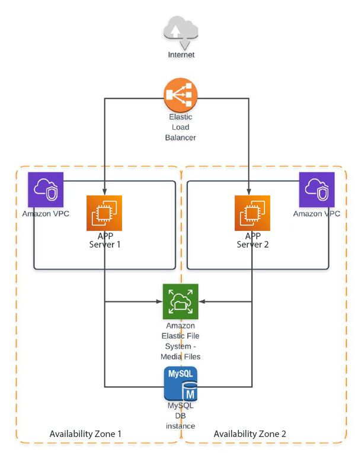

[-orange)](./)
[](http://hits.dwyl.com/HarrierPanels/terraform)
<br>
## Deploy https://github.com/FaztWeb/php-mysql-crud using Terraform / Ansible Toolchain for an AWS multi-tier architecture as follows:
[](./crud-multi-tier.png)
#### Terraform Task
<sub>Must be implemented in the form of two modules: one module - everything related to the network; the second is different
Input parameters of the module: the name of the service (start from it when creating resources). For example, vasya-app-load-balancer, vasya-auto-scaling-group and so on. Input parameters for the program module are instance types; IPs from which there will be access. Outputs: instant sides.State must be a locked remote. Bucket and DB table can be created manually.
It will be a plus: Using terraform cloud.</sub>
#### Ansible Task
<sub>Create your inventory file, in which the host groups: app, db
For all groups - access by ssh key. The configuration of the general ssh parameters and the location of the Inventory - take out in ansible.cfg. Create a playbook that does the following: 1. Installs apache and php on app hosts. 2. Put mysql on the db host. 3. Create a user and a database, which must then be used i db.php. 4. Deploy the project code. For configuration of apache and mysql connection of PHP code, use jinja-templates. Avoid using shell, command and similar modules.</sub>
#### Integrating Terraform and Ansible Tasks: A Unified Execution Strategy
Combining Terraform and Ansible in a single toolchain for deploying a multi-tier architecture on AWS is a common and reasonable approach. Both tools serve different purposes in the infrastructure deployment process:

**Terraform:** Used for infrastructure provisioning. It defines the architecture of your infrastructure, including networks, security groups, instances, databases, etc.

**Ansible:** Used for configuration management and application deployment. It ensures that the software running on your infrastructure is properly configured.

**The benefits of using both tools together include:**<br>
Separation of Concerns: Terraform focuses on infrastructure provisioning, while Ansible focuses on configuration management. This separation makes it easier to manage and understand the different aspects of your infrastructure.

**Idempotency:** Terraform is idempotent by design, meaning it brings the infrastructure to the desired state regardless of its current state. Ansible follows a similar philosophy, making it safe to apply configurations multiple times.

**Scalability:** Terraform excels at defining infrastructure as code, and Ansible excels at configuration management. As your infrastructure grows, you can continue to use Terraform to scale your infrastructure and use Ansible to configure new instances.

**Flexibility:** The combination allows you to leverage the strengths of each tool. Terraform can handle complex infrastructure changes, while Ansible provides flexibility in configuring software components.

**Reusability:** With separate Terraform modules and Ansible roles, you can reuse code for similar setups in different environments, making it easier to maintain and update.

Using only Terraform or only Ansible for a multi-tier architecture can have certain drawbacks, and using a toolchain that combines both can address these limitations. Let's explore the cons of using only Terraform or only Ansible for such an architecture:
#### Using Only Terraform:


#### Terraform / Ansible Toolchain structure:
```
terraform/
└── ansible/
    ├── crud.yaml [*]
    ├── hosts [*]
    └── roles/
        └── crud/
            └── tasks/
                └── main.yml
terraform/
├── crud.tmpl
├── main.tf
├── outputs.tf
├── servers.tmpl
├── userdata.tpl
├── userdata.sh [*]
└── variables.tf
```
<sub>[*] created by terraform from a template</sub>

