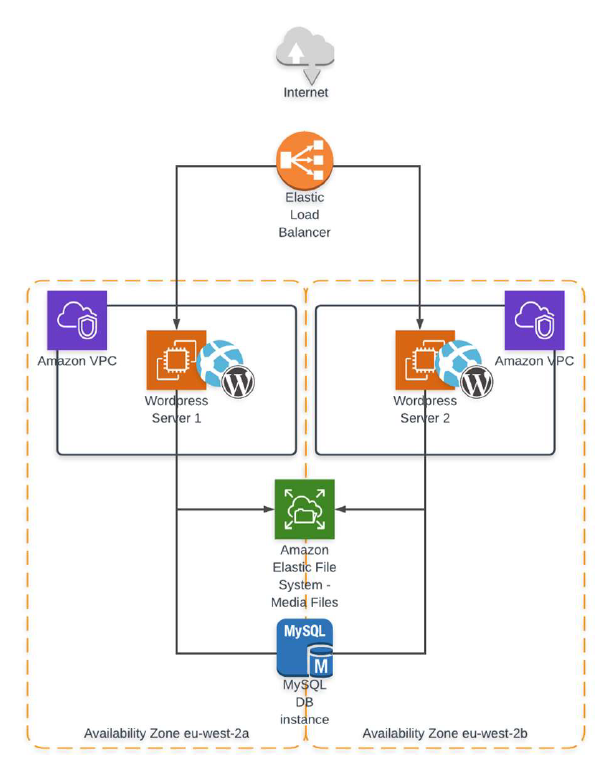

[-orange)](./)

 
## Deploy https://github.com/FaztWeb/php-mysql-crud using Terraform / Ansible Toolchain for an AWS multi-tier architecture as follows:

#### Terraform
Must be implemented in the form of two modules: one module - everything related to the network; the second is different
Input parameters of the module: the name of the service (start from it when creating resources). For example, vasya-app-load-balancer, vasya-auto-scaling-group and so on. Input parameters for the program module are instance types; IPs from which there will be access. Outputs: instant sides.State must be a locked remote. Bucket and DB table can be created manually.
It will be a plus: Using terraform cloud.
#### Ansible
Create your inventory file, in which the host groups: app, db
For all groups - access by ssh key. The configuration of the general ssh parameters and the location of the Inventory - take out in ansible.cfg. Create a playbook that does the following: 1. Installs apache and php on app hosts. 2. Put mysql on the db host. 3. Create a user and a database, which must then be used i db.php. 4. Deploy the project code. For configuration of apache and mysql connection of PHP code, use jinja-templates. Avoid using shell, command and similar modules.
