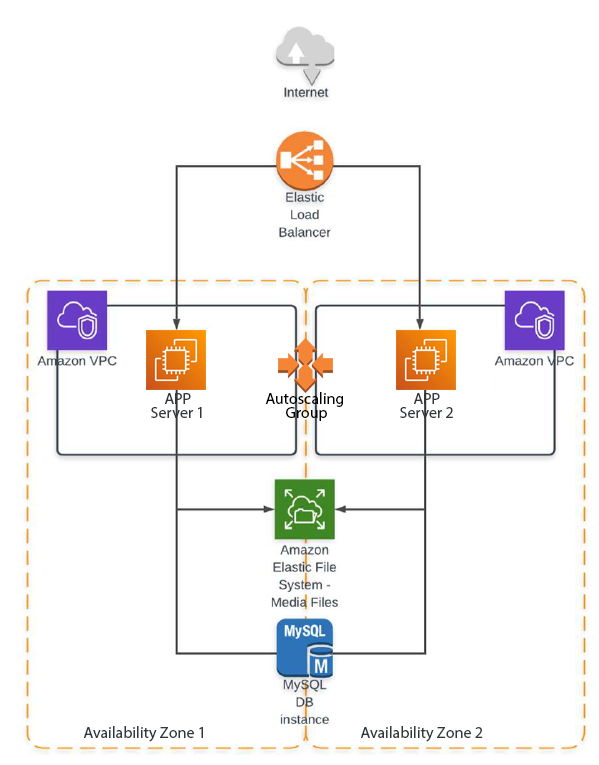

[-orange)](./)
[](http://hits.dwyl.com/HarrierPanels/terraform)
<br>
## Deploy https://github.com/FaztWeb/php-mysql-crud using Terraform / Ansible Toolchain for an AWS multi-tier architecture as follows:
[](./CRUD-multi-tier.png)
#### Terraform Task
<sub>Must be implemented in the form of two modules: one module - everything related to the network; the second is different
Input parameters of the module: the name of the service (start from it when creating resources). For example, vasya-app-load-balancer, vasya-auto-scaling-group and so on. Input parameters for the program module are instance types; IPs from which there will be access. Outputs: instant sides.State must be a locked remote. Bucket and DB table can be created manually.
It will be a plus: Using terraform cloud.</sub>
#### Ansible Task
<sub>Create your inventory file, in which the host groups: app, db
For all groups - access by ssh key. The configuration of the general ssh parameters and the location of the Inventory - take out in ansible.cfg. Create a playbook that does the following: 1. Installs apache and php on app hosts. 2. Put mysql on the db host. 3. Create a user and a database, which must then be used i db.php. 4. Deploy the project code. For configuration of apache and mysql connection of PHP code, use jinja-templates. Avoid using shell, command and similar modules.</sub>
#### Integrating Terraform and Ansible Tasks: A Unified Execution Strategy
Combining Terraform and Ansible in a single toolchain for deploying a multi-tier architecture on AWS is a common and reasonable approach. Both tools serve different purposes in the infrastructure deployment process:

**Terraform:** Used for infrastructure provisioning. It defines the architecture of your infrastructure, including networks, security groups, instances, databases, etc.

**Ansible:** Used for configuration management and application deployment. It ensures that the software running on your infrastructure is properly configured.

**The benefits of using both tools together include:**<br>
Separation of Concerns: Terraform focuses on infrastructure provisioning, while Ansible focuses on configuration management. This separation makes it easier to manage and understand the different aspects of your infrastructure.

**Idempotency:** Terraform is idempotent by design, meaning it brings the infrastructure to the desired state regardless of its current state. Ansible follows a similar philosophy, making it safe to apply configurations multiple times.

**Scalability:** Terraform excels at defining infrastructure as code, and Ansible excels at configuration management. As your infrastructure grows, you can continue to use Terraform to scale your infrastructure and use Ansible to configure new instances.

**Flexibility:** The combination allows you to leverage the strengths of each tool. Terraform can handle complex infrastructure changes, while Ansible provides flexibility in configuring software components.

**Reusability:** With separate Terraform modules and Ansible roles, you can reuse code for similar setups in different environments, making it easier to maintain and update.

Using only Terraform or only Ansible for a multi-tier architecture can have certain drawbacks, and using a toolchain that combines both can address these limitations. Let's explore the cons of using only Terraform or only Ansible for such an architecture:
#### Using Only Terraform:
**Configuration Management Limitations:**
- Terraform is primarily designed for infrastructure provisioning and may lack the robustness and features required for detailed configuration management.
- Managing software configurations, application deployments, and dynamic changes on instances might be challenging.

**Limited Idempotency:**
- While Terraform is idempotent at the infrastructure level, it may not be as effective at managing configurations on instances.
- Making changes to configuration files or installing software may not be as reliable or idempotent as Ansible.

**Complexity for Application Deployment:**
- As the complexity of application deployments increases, handling it solely through Terraform may result in complex and less maintainable code.
#### Using Only Ansible:
**Infrastructure Provisioning:**
- While Ansible is excellent for configuration management, it lacks Terraform's ability to manage the complete lifecycle of infrastructure.
- Defining network architecture, security groups, and other infrastructure elements might be less intuitive in Ansible.

**Limited State Management:**
- Ansible does not inherently manage state, making it less suitable for tracking the state of the infrastructure and handling drift.
- Keeping track of resource dependencies and managing changes in a complex infrastructure might be challenging.

**Less Declarative:**
- Ansible is more procedural and imperative, which may result in less declarative and more step-by-step scripting for infrastructure setup.
#### Using a Toolchain (Terraform + Ansible):
**Leveraging Strengths:**
- Combining Terraform for infrastructure provisioning and Ansible for configuration management leverages the strengths of each tool.
- Terraform provides a declarative approach to define infrastructure, while Ansible handles configuration and application deployment more flexibly.

**Scalability and Reusability:**
- The toolchain approach allows for scalable infrastructure changes using Terraform and reusable, modular Ansible roles for consistent configuration across instances.

**Better Collaboration:**
- Teams with expertise in different areas (infrastructure vs. configuration management) can collaborate more effectively, each focusing on their strengths.

**Clear Separation of Concerns:**
- Separating infrastructure provisioning and configuration management provides clarity in responsibilities and makes codebases more manageable.
#### Prerequisites
- AWS S3 Bucket
- DynamoDB Database
- EC2 key pair
- CRUD GitHub Repo
- Terraform / Ansible controller VM
#### Remote Backend Setup
```
[ec2-user@ip-192-168-0-145 terraform]$ aws s3api create-bucket --bucket terraform-ansible-task --acl private
{
    "Location": "/terraform-ansible-task"
}
[ec2-user@ip-192-168-0-145 terraform]$ aws s3api put-bucket-versioning --bucket terraform-ansible-task --versioning-configuration Status=Enabled
[ec2-user@ip-192-168-0-145 terraform]$ aws s3api put-object --bucket terraform-ansible-task --key environments/production/
{
    "ETag": "\"d41d8cd98f00b204e9800998ecf8427e\"",
    "ServerSideEncryption": "AES256",
    "VersionId": "s4OKmv9KcksGxPn46WyW99UQ2pPSVS3T"
}
[ec2-user@ip-192-168-0-145 terraform]$ aws s3 ls s3://terraform-ansible-task --recursive
2023-12-12 18:36:59          0 environments/production/
[ec2-user@ip-192-168-0-145 terraform]$ aws dynamodb create-table \
    --table-name terraform-lock-table \
    --attribute-definitions AttributeName=LockID,AttributeType=S \
    --key-schema AttributeName=LockID,KeyType=HASH \
    --provisioned-throughput ReadCapacityUnits=5,WriteCapacityUnits=5
{
    "TableDescription": {
        "AttributeDefinitions": [
            {
                "AttributeName": "LockID",
                "AttributeType": "S"
            }
        ],
        "TableName": "terraform-lock-table",
        "KeySchema": [
            {
                "AttributeName": "LockID",
                "KeyType": "HASH"
            }
        ],
        "TableStatus": "CREATING",
        "CreationDateTime": "2023-12-12T18:40:35.406000+00:00",
        "ProvisionedThroughput": {
            "NumberOfDecreasesToday": 0,
            "ReadCapacityUnits": 5,
            "WriteCapacityUnits": 5
        },
        "TableSizeBytes": 0,
        "ItemCount": 0,
        "TableArn": "arn:aws:dynamodb:us-east-1:325618140111:table/terraform-lock-table",
        "TableId": "dfa7ca03-476f-4d36-9a2c-d37c2c50eac9",
        "DeletionProtectionEnabled": false
    }
}
[ec2-user@ip-192-168-0-145 terraform]$ aws sts get-caller-identity --query Arn
"arn:aws:iam::325618140111:user/cloud_user"
[ec2-user@ip-192-168-0-145 terraform]$ aws s3api get-bucket-policy \
    --bucket terraform-ansible-task --query Policy |
    jq -r 'fromjson | {Version: .Version, Statement: .Statement}'
{
  "Version": "2012-10-17",
  "Statement": [
    {
      "Effect": "Allow",
      "Principal": {
        "AWS": "arn:aws:iam::325618140111:user/cloud_user"
      },
      "Action": "s3:ListBucket",
      "Resource": "arn:aws:s3:::terraform-ansible-task"
    },
    {
      "Effect": "Allow",
      "Principal": {
        "AWS": "arn:aws:iam::325618140111:user/cloud_user"
      },
      "Action": [
        "s3:GetObject",
        "s3:PutObject"
      ],
      "Resource": "arn:aws:s3:::terraform-ansible-task/*"
    }
  ]
}
[ec2-user@ip-192-168-0-145 terraform]$ terraform init

Initializing the backend...

Successfully configured the backend "s3"! Terraform will automatically
use this backend unless the backend configuration changes.

Initializing provider plugins...
- Reusing previous version of hashicorp/http from the dependency lock file
- Reusing previous version of hashicorp/aws from the dependency lock file
- Reusing previous version of hashicorp/null from the dependency lock file
- Reusing previous version of hashicorp/local from the dependency lock file
- Using previously-installed hashicorp/http v3.4.0
- Using previously-installed hashicorp/aws v5.29.0
- Using previously-installed hashicorp/null v3.2.2
- Using previously-installed hashicorp/local v2.4.0

Terraform has made some changes to the provider dependency selections recorded
in the .terraform.lock.hcl file. Review those changes and commit them to your
version control system if they represent changes you intended to make.

Terraform has been successfully initialized!

You may now begin working with Terraform. Try running "terraform plan" to see
any changes that are required for your infrastructure. All Terraform commands
should now work.

If you ever set or change modules or backend configuration for Terraform,
rerun this command to reinitialize your working directory. If you forget, other
commands will detect it and remind you to do so if necessary.
```
#### Terraform / Ansible Toolchain structure:
```
terraform/
└── ansible/
    ├── crud.yaml [*]
    ├── hosts [*]
    └── roles/
        └── crud/
            └── tasks/
                └── main.yml
terraform/
├── crud.tmpl
├── main.tf
├── outputs.tf
├── servers.tmpl
├── userdata.tpl
├── userdata.sh [*]
└── variables.tf
```
<sub>[*] created by Terraform from a template</sub>

The provided Terraform configuration sets up a multi-tier architecture on AWS, including a VPC, subnets, internet gateway, route tables, EFS (Elastic File System), security groups, RDS (Relational Database Service), EC2 instances, and an ELB (Elastic Load Balancer) with Autoscaling Group. After the infrastructure is provisioned using Terraform, Ansible is used to configure the instances and deploy a PHP-MySQL CRUD application.

Here's the high-level workflow:
#### Terraform:
- **Infrastructure Provisioning:**
  - AWS resources are defined in the Terraform configuration (**[main.tf](terraform/main.tf)**), including VPC, subnets, internet gateway, route tables, EFS, security groups, RDS, EC2 instances, ELB, Autoscaling group, and CloudWatch Alarms.
  - Dependencies between resources are specified using the **depends_on** attribute to ensure proper provisioning order.

- **UserData Script:**
  - A crucial part of the Terraform configuration is the UserData script, defined in the (**[userdata.tpl](terraform/userdata.tpl)**) template. This script is crafted to be executed on EC2 instances during launch.
  - The UserData script, generated by Terraform from the specified template, plays a pivotal role in the AWS Launch Configuration. Specifically designed for use within an AWS Auto Scaling Group, this script automates the instance initialization process.
  - The script performs the following tasks:
    - Installs required packages to ensure a consistent and functional environment.
    - Updates the system to the latest patches and security updates.
    - Installs essential software components, including Apache, PHP, and MySQL, to set up the necessary runtime for the application.
    - Mounts the Amazon Elastic File System (EFS) file system, providing shared storage for application files.
    - Initiates and starts relevant services, ensuring a fully operational state for the EC2 instance.
  - Importantly, the UserData script is dynamically generated by Terraform using the userdata.tpl template. This template allows for the insertion of dynamic values and configuration parameters, adapting to the specific needs of the environment. The script is then seamlessly integrated into the AWS Launch Configuration, facilitating the deployment and scaling processes within the AWS Auto Scaling Group. See **[userdata.log](terraform/userdata.log)**.

- **EFS Shared File System:**
  - The Terraform configuration includes the setup of an Amazon Elastic File System (EFS). This EFS file system is used to share files among multiple EC2 instances.
  - The Ansible playbook is designed to be executed on one of the EC2 instances within the Auto Scaling Group. Once executed, the shared EFS becomes a central location for storing application files, ensuring consistency across all instances.
  - This design simplifies the deployment process since updates to the application or its configuration can be done on a single instance, and the changes are immediately reflected across all instances sharing the same EFS. It promotes a more efficient and scalable approach, especially in dynamic and auto-scaling environments.

- **Dynamic Inventory:**
  - To facilitate dynamic discovery and management of AWS EC2 instances, a dynamic inventory is employed. In this setup, the data "aws_instances" block in Terraform is utilized.
  - The Ansible inventory file, an essential component for orchestrating tasks across the infrastructure, is dynamically generated from the **[servers.tmpl](terraform/servers.tmpl)** template. This template includes the necessary configuration to organize and specify hosts within Ansible.
  - The dynamic inventory process dynamically identifies AWS EC2 instances, retrieving information such as public IP addresses. These instances are then seamlessly integrated into the Ansible inventory, ensuring that the playbook tasks are executed on the correct hosts.
  - It's noteworthy that the inventory file generation is an integral part of the overall automation process, enhancing flexibility and scalability in managing the infrastructure.

- **Terraform Remote Backend:**
  - The Terraform configuration benefits from a Remote Backend, specifically an AWS S3 bucket configured as the backend for storing the Terraform state file (terraform.tfstate).
  - The backend "s3" block in the Terraform configuration defines the settings for this remote backend. The S3 bucket (**terraform-ansible-task**), key (*environments/production/terraform.tfstate*), and DynamoDB table (**terraform-lock-table**) collectively serve as a robust infrastructure state management solution.
  - This remote backend configuration enhances collaboration and state management, allowing multiple team members to work on the infrastructure concurrently. It provides a centralized location for storing and versioning the Terraform state, promoting consistency and avoiding conflicts in a collaborative environment. The use of DynamoDB for state locking ensures the integrity of the state file during concurrent operations.

- **[Output Values:](terraform/outputs.tf)**
  - Outputs like EFS DNS name and RDS endpoint are defined to be used in Ansible.
 
- **Terraform Variables:**
  - The **[variables.tf](terraform/variables.tf)** file plays a crucial role in managing dynamic values and parameters in the Terraform configuration.
  - This file defines variables, such as the **rds_credentials** variable, which encapsulates sensitive information like the master DB username, password, and database name.
  - The **rds_credentials** variable is of type **object** and is set to default values in this configuration. However, it's designed to be easily customized by users, allowing for a secure and flexible approach to managing database credentials.
  - By externalizing these variable values, the Terraform configuration becomes more modular and adaptable. Users can customize these variables based on their specific requirements, promoting reusability and ensuring that sensitive information remains confidential.
  - When deploying the infrastructure, users can provide values for these variables interactively or through various methods, such as input files, environment variables, or command-line flags.
  - In summary, **[variables.tf](terraform/variables.tf)** enhances the configurability and security of the Terraform setup by centralizing variable definitions and allowing users to customize values according to their specific needs.

 #### Ansible
 - **Playbook:**
   - An Ansible playbook (**[crud.yaml](terraform/crud.yaml)**) is dynamically generated by Terraform using a template (crud.tmpl). This playbook orchestrates various tasks on EC2 instances within the deployed infrastructure.
   - Tasks encompass a range of activities such as installing necessary packages, downloading and extracting the CRUD application, modifying SQL scripts, updating PHP files with dynamic values obtained from the deployed infrastructure, and configuring Apache.
   - The template used to generate the playbook incorporates variables derived from the deployed infrastructure, ensuring that the playbook aligns with the specifics of the actual environment. This seamless integration between Terraform and Ansible enhances automation, consistency, and the overall manageability of the infrastructure.

- **Inventory File:**
  - An inventory file (**hosts**) is generated dynamically with the public IP of the EC2 instance.

 - **Execution:**
   - Ansible is executed using the **null_resource** and **local-exec** provisioner in Terraform.
   - Ansible playbook is run on EC2 instances to configure the software and deploy the PHP-MySQL CRUD application.

#### Terraform apply process:
```
[ec2-user@ip-192-168-0-145 terraform]$ terraform apply -auto-approve >logs
```
The **[logs](terraform/logs)** show the Terraform apply process, including resource creation, progress updates, and Ansible playbook execution. Key steps include acquiring a state lock, generating a plan, creating AWS resources (VPC, subnets, security groups, RDS, EFS, etc.), and executing an Ansible playbook. Outputs include the DNS name for the EFS file system and the RDS endpoint.
#### Terraform State file:
```
[ec2-user@ip-192-168-0-145 terraform]$ aws s3 ls s3://terraform-ansible-task --recursive
2023-12-12 18:36:59          0 environments/production/
2023-12-12 19:10:44      59132 environments/production/terraform.tfstate
[ec2-user@ip-192-168-0-145 terraform]$ aws dynamodb scan --table-name terraform-lock-table

{
    "Items": [
        {
            "LockID": {
                "S": "terraform-ansible-task/environments/production/terraform.tfstate-md5"
            },
            "Digest": {
                "S": "14cf95613d7a1f5cd6d89be4528912b8"
            }
        }
    ],
    "Count": 1,
    "ScannedCount": 1,
    "ConsumedCapacity": null
}
```
#### VPC:
```
[ec2-user@ip-192-168-0-145 terraform]$ aws ec2 describe-vpcs
{
    "Vpcs": [
        {
            "CidrBlock": "10.0.0.0/16",
            "DhcpOptionsId": "dopt-0f21acf582e3e8366",
            "State": "available",
            "VpcId": "vpc-01550116fd4f544b4",
            "OwnerId": "325618140111",
            "InstanceTenancy": "default",
            "CidrBlockAssociationSet": [
                {
                    "AssociationId": "vpc-cidr-assoc-0ec3b8b283d5e2dd5",
                    "CidrBlock": "10.0.0.0/16",
                    "CidrBlockState": {
                        "State": "associated"
                    }
                }
            ],
            "IsDefault": false,
            "Tags": [
                {
                    "Key": "Name",
                    "Value": "crud_vpc"
                }
            ]
        },
        {
            "CidrBlock": "172.31.0.0/16",
            "DhcpOptionsId": "dopt-0f21acf582e3e8366",
            "State": "available",
            "VpcId": "vpc-00e49357f011c7ae5",
            "OwnerId": "325618140111",
            "InstanceTenancy": "default",
            "CidrBlockAssociationSet": [
                {
                    "AssociationId": "vpc-cidr-assoc-0c6762e157cac9054",
                    "CidrBlock": "172.31.0.0/16",
                    "CidrBlockState": {
                        "State": "associated"
                    }
                }
            ],
            "IsDefault": true
        }
    ]
}
```
#### Database
```
[ec2-user@ip-192-168-0-145 terraform]$ aws rds describe-db-instances --db-instance-identifier mysql
{
    "DBInstances": [
        {
            "DBInstanceIdentifier": "mysql",
            "DBInstanceClass": "db.t3.medium",
            "Engine": "mysql",
            "DBInstanceStatus": "available",
            "MasterUsername": "username",
            "DBName": "dbname",
            "Endpoint": {
                "Address": "mysql.crmzqzrcrpkm.us-east-1.rds.amazonaws.com",
                "Port": 3306,
                "HostedZoneId": "Z2R2ITUGPM61AM"
            },
            "AllocatedStorage": 20,
            "InstanceCreateTime": "2023-12-12T19:02:28.615000+00:00",
            "PreferredBackupWindow": "00:00-00:30",
            "BackupRetentionPeriod": 7,
            "DBSecurityGroups": [],
            "VpcSecurityGroups": [
                {
                    "VpcSecurityGroupId": "sg-0cbd0be57d380721a",
                    "Status": "active"
                }
            ],
            "DBParameterGroups": [
                {
                    "DBParameterGroupName": "default.mysql8.0",
                    "ParameterApplyStatus": "in-sync"
                }
            ],
            "AvailabilityZone": "us-east-1b",
            "DBSubnetGroup": {
                "DBSubnetGroupName": "main",
                "DBSubnetGroupDescription": "Managed by Terraform",
                "VpcId": "vpc-01550116fd4f544b4",
                "SubnetGroupStatus": "Complete",
                "Subnets": [
                    {
                        "SubnetIdentifier": "subnet-0f38077a9a17c2d71",
                        "SubnetAvailabilityZone": {
                            "Name": "us-east-1b"
                        },
                        "SubnetOutpost": {},
                        "SubnetStatus": "Active"
                    },
                    {
                        "SubnetIdentifier": "subnet-03fd3612d7a72aef6",
                        "SubnetAvailabilityZone": {
                            "Name": "us-east-1a"
                        },
                        "SubnetOutpost": {},
                        "SubnetStatus": "Active"
                    }
                ]
            },
            "PreferredMaintenanceWindow": "sun:21:00-sun:21:30",
            "PendingModifiedValues": {},
            "LatestRestorableTime": "2023-12-12T19:25:00+00:00",
            "MultiAZ": false,
            "EngineVersion": "8.0.28",
            "AutoMinorVersionUpgrade": true,
            "ReadReplicaDBInstanceIdentifiers": [],
            "LicenseModel": "general-public-license",
            "OptionGroupMemberships": [
                {
                    "OptionGroupName": "default:mysql-8-0",
                    "Status": "in-sync"
                }
            ],
            "PubliclyAccessible": false,
            "StorageType": "gp2",
            "DbInstancePort": 0,
            "StorageEncrypted": false,
            "DbiResourceId": "db-POHUAPS4RS4IOL5F4E6VVQWOMI",
            "CACertificateIdentifier": "rds-ca-2019",
            "DomainMemberships": [],
            "CopyTagsToSnapshot": false,
            "MonitoringInterval": 0,
            "DBInstanceArn": "arn:aws:rds:us-east-1:325618140111:db:mysql",
            "IAMDatabaseAuthenticationEnabled": false,
            "PerformanceInsightsEnabled": false,
            "EnabledCloudwatchLogsExports": [
                "error",
                "general"
            ],
            "DeletionProtection": false,
            "AssociatedRoles": [],
            "TagList": [],
            "CustomerOwnedIpEnabled": false,
            "ActivityStreamStatus": "stopped",
            "BackupTarget": "region",
            "NetworkType": "IPV4",
            "StorageThroughput": 0,
            "CertificateDetails": {
                "CAIdentifier": "rds-ca-2019",
                "ValidTill": "2024-08-22T17:08:50+00:00"
            },
            "DedicatedLogVolume": false,
            "IsStorageConfigUpgradeAvailable": false
        }
    ]
}
```
#### Elastic File System
```
[ec2-user@ip-192-168-0-145 terraform]$ aws efs describe-file-systems
{
    "FileSystems": [
        {
            "OwnerId": "325618140111",
            "CreationToken": "terraform-20231212185800927400000001",
            "FileSystemId": "fs-0f3d6e7941bedbc04",
            "FileSystemArn": "arn:aws:elasticfilesystem:us-east-1:325618140111:file-system/fs-0f3d6e7941bedbc04",
            "CreationTime": "2023-12-12T18:58:02+00:00",
            "LifeCycleState": "available",
            "Name": "MyEFS",
            "NumberOfMountTargets": 2,
            "SizeInBytes": {
                "Value": 6144,
                "ValueInIA": 0,
                "ValueInStandard": 6144,
                "ValueInArchive": 0
            },
            "PerformanceMode": "generalPurpose",
            "Encrypted": true,
            "KmsKeyId": "arn:aws:kms:us-east-1:325618140111:key/55105398-49cb-474f-a601-ebaa540edbc7",
            "ThroughputMode": "bursting",
            "Tags": [
                {
                    "Key": "Name",
                    "Value": "MyEFS"
                }
            ],
            "FileSystemProtection": {
                "ReplicationOverwriteProtection": "ENABLED"
            }
        }
    ]
}
```
#### Elastic Load Balancer
```
[ec2-user@ip-192-168-0-145 terraform]$ aws elb describe-load-balancers
{
    "LoadBalancerDescriptions": [
        {
            "LoadBalancerName": "My-ELB",
            "DNSName": "My-ELB-329346245.us-east-1.elb.amazonaws.com",
            "CanonicalHostedZoneName": "My-ELB-329346245.us-east-1.elb.amazonaws.com",
            "CanonicalHostedZoneNameID": "Z35SXDOTRQ7X7K",
            "ListenerDescriptions": [
                {
                    "Listener": {
                        "Protocol": "HTTP",
                        "LoadBalancerPort": 80,
                        "InstanceProtocol": "HTTP",
                        "InstancePort": 80
                    },
                    "PolicyNames": []
                }
            ],
            "Policies": {
                "AppCookieStickinessPolicies": [],
                "LBCookieStickinessPolicies": [],
                "OtherPolicies": []
            },
            "BackendServerDescriptions": [],
            "AvailabilityZones": [
                "us-east-1a",
                "us-east-1b"
            ],
            "Subnets": [
                "subnet-03fd3612d7a72aef6",
                "subnet-0f38077a9a17c2d71"
            ],
            "VPCId": "vpc-01550116fd4f544b4",
            "Instances": [
                {
                    "InstanceId": "i-0611ceeedbf13eba0"
                },
                {
                    "InstanceId": "i-01c72729eab844f4a"
                }
            ],
            "HealthCheck": {
                "Target": "TCP:80",
                "Interval": 20,
                "Timeout": 5,
                "UnhealthyThreshold": 2,
                "HealthyThreshold": 2
            },
            "SourceSecurityGroup": {
                "OwnerAlias": "325618140111",
                "GroupName": "SG_for_ELB"
            },
            "SecurityGroups": [
                "sg-06932c2d6c3ef1189"
            ],
            "CreatedTime": "2023-12-12T18:58:18.680000+00:00",
            "Scheme": "internet-facing"
        }
    ]
}
```
#### Auto Scaling Group
```
[ec2-user@ip-192-168-0-145 terraform]$ aws autoscaling describe-auto-scaling-groups
{
    "AutoScalingGroups": [
        {
            "AutoScalingGroupName": "my_asg20231212185942776500000003",
            "AutoScalingGroupARN": "arn:aws:autoscaling:us-east-1:325618140111:autoScalingGroup:a9773797-0a5b-4797-b2f0-a5adc0771a8e:autoScalingGroupName/my_asg20231212185942776500000003",
            "LaunchConfigurationName": "My Launch Config with WP20231212185821981700000002",
            "MinSize": 2,
            "MaxSize": 4,
            "DesiredCapacity": 2,
            "DefaultCooldown": 300,
            "AvailabilityZones": [
                "us-east-1a",
                "us-east-1b"
            ],
            "LoadBalancerNames": [
                "My-ELB"
            ],
            "TargetGroupARNs": [],
            "HealthCheckType": "ELB",
            "HealthCheckGracePeriod": 300,
            "Instances": [
                {
                    "InstanceId": "i-01c72729eab844f4a",
                    "InstanceType": "t3.medium",
                    "AvailabilityZone": "us-east-1a",
                    "LifecycleState": "InService",
                    "HealthStatus": "Healthy",
                    "LaunchConfigurationName": "My Launch Config with WP20231212185821981700000002",
                    "ProtectedFromScaleIn": false
                },
                {
                    "InstanceId": "i-0611ceeedbf13eba0",
                    "InstanceType": "t3.medium",
                    "AvailabilityZone": "us-east-1b",
                    "LifecycleState": "InService",
                    "HealthStatus": "Healthy",
                    "LaunchConfigurationName": "My Launch Config with WP20231212185821981700000002",
                    "ProtectedFromScaleIn": false
                }
            ],
            "CreatedTime": "2023-12-12T18:59:43.993000+00:00",
            "SuspendedProcesses": [],
            "VPCZoneIdentifier": "subnet-0f38077a9a17c2d71,subnet-03fd3612d7a72aef6",
            "EnabledMetrics": [],
            "Tags": [],
            "TerminationPolicies": [
                "Default"
            ],
            "NewInstancesProtectedFromScaleIn": false,
            "ServiceLinkedRoleARN": "arn:aws:iam::325618140111:role/aws-service-role/autoscaling.amazonaws.com/AWSServiceRoleForAutoScaling",
            "TrafficSources": [
                {
                    "Identifier": "My-ELB",
                    "Type": "elb"
                }
            ]
        }
    ]
}
```
#### CRUD App
```
[ec2-user@ip-10-0-2-48 ~]$ curl -s https://checkip.amazonaws.com
3.83.142.127
[ec2-user@ip-10-0-2-48 ~]$ curl -v localhost
*   Trying 127.0.0.1:80...
* Connected to localhost (127.0.0.1) port 80
> GET / HTTP/1.1
> Host: localhost
> User-Agent: curl/8.3.0
> Accept: */*
>
< HTTP/1.1 200 OK
< Date: Tue, 12 Dec 2023 19:51:58 GMT
< Server: Apache/2.4.58 () PHP/7.4.33
< Upgrade: h2,h2c
< Connection: Upgrade
< X-Powered-By: PHP/7.4.33
< Set-Cookie: PHPSESSID=vbcg4aaag02254m3m6bna8ppra; path=/
< Expires: Thu, 19 Nov 1981 08:52:00 GMT
< Cache-Control: no-store, no-cache, must-revalidate
< Pragma: no-cache
< Content-Length: 3346
< Content-Type: text/html; charset=UTF-8
<

<!DOCTYPE html>
<html lang="en">
  <head>
    <meta charset="UTF-8">
    <title>PHP CRUD MYSQL</title>
    <meta name="viewport" content="width=device-width, user-scalable=no, initial-scale=1.0, maximum-scale=1.0, minimum-scale=1.0">
    <!-- BOOTSTRAP 4 -->
    <link rel="stylesheet" href="https://bootswatch.com/4/yeti/bootstrap.min.css">
    <!-- FONT AWESOEM -->
    <link rel="stylesheet" href="https://use.fontawesome.com/releases/v5.6.3/css/all.css" integrity="sha384-UHRtZLI+pbxtHCWp1t77Bi1L4ZtiqrqD80Kn4Z8NTSRyMA2Fd33n5dQ8lWUE00s/" crossorigin="anonymous">
  </head>
  <body>

    <nav class="navbar navbar-dark bg-dark">
      <div class="container">
        <a class="navbar-brand" href="index.php">PHP MySQL CRUD IP: 3.83.142.127 | 10.0.2.48</a>
      </div>
    </nav>

<main class="container p-4">
  <div class="row">
    <div class="col-md-4">
      <!-- MESSAGES -->


      <!-- ADD TASK FORM -->
      <div class="card card-body">
        <form action="save_task.php" method="POST">
          <div class="form-group">
            <input type="text" name="title" class="form-control" placeholder="Task Title" autofocus>
          </div>
          <div class="form-group">
            <textarea name="description" rows="2" class="form-control" placeholder="Task Description"></textarea>
          </div>
          <input type="submit" name="save_task" class="btn btn-success btn-block" value="Save Task">
        </form>
      </div>
    </div>
    <div class="col-md-8">
      <table class="table table-bordered">
        <thead>
          <tr>
            <th>Title</th>
            <th>Description</th>
            <th>Created At</th>
            <th>Action</th>
          </tr>
        </thead>
        <tbody>

                    <tr>
            <td>Terraform Task</td>
            <td>Complete!</td>
            <td>2023-12-12 19:12:05</td>
            <td>
              <a href="edit.php?id=1" class="btn btn-secondary">
                <i class="fas fa-marker"></i>
              </a>
              <a href="delete_task.php?id=1" class="btn btn-danger">
                <i class="far fa-trash-alt"></i>
              </a>
            </td>
          </tr>
                    <tr>
            <td>Ansible Task</td>
            <td>Complete!</td>
            <td>2023-12-12 19:12:18</td>
            <td>
              <a href="edit.php?id=2" class="btn btn-secondary">
                <i class="fas fa-marker"></i>
              </a>
              <a href="delete_task.php?id=2" class="btn btn-danger">
                <i class="far fa-trash-alt"></i>
              </a>
            </td>
          </tr>
                  </tbody>
      </table>
    </div>
  </div>
</main>

<!-- BOOTSTRAP 4 SCRIPTS -->
<script src="https://code.jquery.com/jquery-3.3.1.slim.min.js" integrity="sha384-q8i/X+965DzO0rT7abK41JStQIAqVgRVzpbzo5smXKp4YfRvH+8abtTE1Pi6jizo" crossorigin="anonymous"></script>
<script src="https://cdnjs.cloudflare.com/ajax/libs/popper.js/1.14.6/umd/popper.min.js" integrity="sha384-wHAiFfRlMFy6i5SRaxvfOCifBUQy1xHdJ/yoi7FRNXMRBu5WHdZYu1hA6ZOblgut" crossorigin="anonymous"></script>
<script src="https://stackpath.bootstrapcdn.com/bootstrap/4.2.1/js/bootstrap.min.js" integrity="sha384-B0UglyR+jN6CkvvICOB2joaf5I4l3gm9GU6Hc1og6Ls7i6U/mkkaduKaBhlAXv9k" crossorigin="anonymous"></script>
</body>
</html>
* Connection #0 to host localhost left intact

[ec2-user@ip-192-168-0-145 terraform]$ curl -s http://my-elb-329346245.us-east-1.elb.amazonaws.com |
    grep -o 'Terraform Task' &&
    curl -s http://my-elb-329346245.us-east-1.elb.amazonaws.com |
    grep -o -m 1 'Complete!'
Terraform Task
Complete!

[ec2-user@ip-192-168-0-145 terraform]$ curl -s http://my-elb-329346245.us-east-1.elb.amazonaws.com |
    grep -o 'Ansible Task' &&
    curl -s http://my-elb-329346245.us-east-1.elb.amazonaws.com |
    grep -o -m 1 'Complete!'
Ansible Task
Complete!
```
#### Terraform destroy process:
```
[ec2-user@ip-192-168-0-145 terraform]$ terraform destroy -auto-approve >logs_destroy
```
The Terraform destroy logs (**[logs_destroy](terraform/logs_destroy)**) indicate the process of tearing down infrastructure. Notable steps include acquiring a state lock, reading and refreshing data sources, generating a destruction plan, and then sequentially destroying resources. There are warnings about potential permission issues during the cleanup of an ELB Classic Load Balancer. In the end, the logs confirm the completion of the destruction, specifying the number of resources destroyed.<br>
<!DOCTYPE html><html lang="en"><head><meta charset="UTF-8"><meta name="viewport" content="width=device-width, user-scalable=no, initial-scale=1.0, maximum-scale=1.0, minimum-scale=1.0"><!-- BOOTSTRAP 4 --><link rel="stylesheet" href="https://bootswatch.com/4/yeti/bootstrap.min.css"><!-- FONT AWESOEM --><link rel="stylesheet" href="https://use.fontawesome.com/releases/v5.6.3/css/all.css" integrity="sha384-UHRtZLI+pbxtHCWp1t77Bi1L4ZtiqrqD80Kn4Z8NTSRyMA2Fd33n5dQ8lWUE00s/" crossorigin="anonymous"></head><body><nav class="navbar navbar-dark bg-dark"><div class="container"><a class="navbar-brand" href="index.php">PHP MySQL CRUD IP: 3.83.142.127 | 10.0.2.48</a></div></nav><main class="container p-4"><div class="row"><div class="col-md-4"> <!-- MESSAGES --> <!-- ADD TASK FORM --> <div class="card card-body"> <form action="save_task.php" method="POST"> <div class="form-group"> <input type="text" name="title" class="form-control" placeholder="Task Title" autofocus> </div> <div class="form-group"> <textarea name="description" rows="2" class="form-control" placeholder="Task Description"></textarea> </div> <input type="submit" name="save_task" class="btn btn-success btn-block" value="Save Task"> </form> </div> </div> <div class="col-md-8"> <table class="table table-bordered"> <thead> <tr> <th>Title</th> <th>Description</th> <th>Created At</th> <th>Action</th> </tr> </thead> <tbody> <tr> <td>Terraform Task</td> <td>Complete!</td> <td>2023-12-12 19:12:05</td> <td> <a href="edit.php?id=1" class="btn btn-secondary"> <i class="fas fa-marker"></i> </a> <a href="delete_task.php?id=1" class="btn btn-danger"> <i class="far fa-trash-alt"></i> </a> </td> </tr> <tr> <td>Ansible Task</td> <td>Complete!</td> <td>2023-12-12 19:12:18</td> <td> <a href="edit.php?id=2" class="btn btn-secondary"> <i class="fas fa-marker"></i> </a> <a href="delete_task.php?id=2" class="btn btn-danger"> <i class="far fa-trash-alt"></i> </a> </td> </tr> </tbody> </table> </div> </div></main></body></html>
